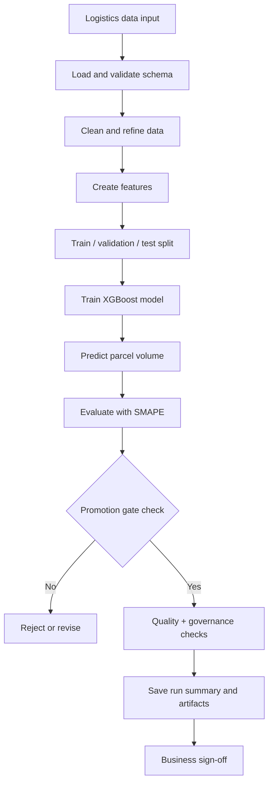

# Parcel Volume Forecasting Project Plan

## Objective

Build a simple, beginner-friendly forecasting workflow that starts from the canonical logistics dataset and ends with a trained model, an objective evaluation, and a clear promotion decision.

The project follows a merged architecture:

- Core training flow runs from data preparation through model evaluation with SMAPE.
- A promotion gate is applied after evaluation to decide whether the model is acceptable for review or rejection.
- Reporting and governance are kept as the final decision and traceability layer.

---

## Architecture overview



This is the recommended execution path for both learning and project review.

---

## Stage 0 — Environment setup
- Goal: prepare a reproducible local environment.
- Why: the project depends on pandas, numpy, xgboost, pytest, and MLflow.
- Commands:
```bash
python -m venv .venv
source .venv/bin/activate
pip install -r requirements-dev.txt
```
- Acceptance: importing the required libraries works without errors.

---

## Stage 1 — Data ingestion
- Goal: load the canonical dataset.
- Source: `data/Logistics data input.csv`
- Example command:
```bash
python -c "import pandas as pd; df = pd.read_csv('data/Logistics data input.csv'); print(df.columns.tolist()); print(len(df))"
```
- Acceptance: the file loads successfully and required columns are present.

---

## Stage 2 — Data validation and cleaning
- Goal: remove invalid records and standardize values.
- Checks:
  - missing required fields
  - invalid or unparsable dates
  - negative or unusable business values
  - incomplete baseline / actual volume rows
- Output: a cleaned DataFrame ready for the refinery stage.
- Acceptance: no nulls in key fields and all core metrics are numeric.

---

## Stage 3 — Refinery and business-rule filtering
- Goal: keep only records that are useful for learning and decision-making.
- Why: outdated or unreliable records can distort the model and reduce business value.
- Filtering logic includes:
  - valid recent rows
  - business-quality checks
  - required columns retained for training
  - row-count summary and guardrail notes
- Output: refined data and a light guardrail summary.
- Acceptance: refined rows are valid, controlled, and ready for modeling.

---

## Stage 4 — Feature engineering
- Goal: create useful signals for the model.
- Typical features:
  - day-of-week
  - weekend indicator
  - cyclical time encodings
  - uplift and uplift percentage fields
- Output: a feature-ready dataset.
- Acceptance: engineered features are numeric and usable in model training.

---

## Stage 5 — Target creation
- Goal: build the learning target.
- Why: using a transformed target is more stable than using raw volume alone when scales vary across records.
- Output: a DataFrame with a valid target field.
- Acceptance: target values are finite and no NaN values remain.

---

## Stage 6 — Train / validation / test split
- Goal: preserve realistic forecasting behavior by splitting by time.
- Why: random splitting would leak future information and distort evaluation.
- Approach:
  - earliest period = train
  - near-term window = validation
  - latest period = test
- Output: non-overlapping train, validation, and test sets.
- Acceptance: date ranges are cleanly separated and ordered.

---

## Stage 7 — Model training
- Goal: train the forecasting model.
- Model: XGBoost regressor
- Typical command:
```bash
python -m src.training.train_xgboost --input-csv tmp/engineered.csv --experiment local_smoke --run-mode debug
```
- Output: trained model artifact and logs.
- Acceptance: training completes successfully without errors.

---

## Stage 8 — Prediction and volume reconstruction
- Goal: generate forecasts and convert them back to interpretable business volume values.
- Why: business users care about predicted volume, not only transformed target values.
- Output: predicted volume values for evaluation.
- Acceptance: predictions are positive and remain in a realistic range.

---

## Stage 9 — Evaluate with SMAPE
- Goal: quantify model quality in a simple, understandable metric.
- Why: SMAPE is easier for business audiences to interpret than raw prediction error.
- Typical checks:
  - compute SMAPE on the test set
  - compare against a threshold such as 40%
  - determine pass/fail status
- Output: metric summary and pass/fail result.
- Acceptance: a valid SMAPE value and a clear decision outcome are produced.

---

## Stage 10 — Promotion gate
- Goal: decide whether the model should move forward.
- This is the decision checkpoint after evaluation.
- The promotion gate checks:
  - performance threshold
  - operational risk or archetype impact
  - governance completeness
  - artifact readiness and reproducibility
- Output: pass or reject decision with rationale.
- Acceptance: the decision is explicit and explainable.

---

## Stage 11 — Reporting and artifact generation
- Goal: save a traceable, review-ready summary for stakeholders.
- Output:
  - model artifact
  - metric summary
  - governance summary
  - JSON/HTML run report
- Acceptance: artifact files exist and are readable by reviewers.

---

## Stage 12 — MLflow traceability
- Goal: register the run and its metadata.
- Why: traceability is essential for comparing experiments and reproducing results.
- Output: experiment metadata, metrics, and artifacts in MLflow.
- Acceptance: a local MLflow experiment is created and populated.

---

## Stage 13 — Scheduled production-style pipeline job
- Goal: simulate a basic daily production run without requiring a full orchestration system.
- Why: in learning projects, a scheduled job helps demonstrate how a model pipeline can run automatically at a fixed time each day.
- Workflow: GitHub Actions runs on code changes and also executes on a daily cron schedule to mimic a production batch job.
- Job behavior:
  - set up Python 3.12
  - install dependencies
  - run the project test suite
  - trigger a lightweight training smoke run using the canonical dataset
- Schedule example: 09:00 UTC every day
- Output: automated evidence that the pipeline still works on a regular cadence, similar to a basic production job.
- Acceptance: the workflow includes a scheduled trigger and the project can demonstrate daily execution in a simple, learnable way.

---

## Expected result

A successful run should:

1. load the canonical logistics data,
2. validate and clean the rows,
3. engineer training features,
4. train a model,
5. evaluate it with SMAPE,
6. pass it through a promotion gate,
7. save model and report artifacts,
8. leave a clear audit trail for review.

---

## Implementation priority

### Phase 1 — Core learning path
1. Setup
2. Data ingestion
3. Validation and cleaning
4. Refinery filtering
5. Feature engineering
6. Target creation
7. Train/validation/test split
8. Training
9. Prediction
10. Evaluation with SMAPE

### Phase 2 — Decision and reporting layer
11. Promotion gate
12. Governance checks
13. MLflow tracking
14. Run summary and artifact generation

### Phase 3 — Automation and quality gates
15. GitHub Actions CI workflow
16. Automated regression checks on pull requests and main branch pushes

---

## PR plan
- PR-1: setup and environment
- PR-2: data ingestion and validation
- PR-3: refinery and guardrails
- PR-4: feature engineering
- PR-5: target creation
- PR-6: splitting logic
- PR-7: training loop and artifact output
- PR-8: prediction and reconstruction
- PR-9: SMAPE evaluation
- PR-10: promotion gate logic
- PR-11: report generation and MLflow logging
- PR-12: tests and CI
- PR-13: CI hardening and workflow maintenance

---

## Project acceptance criteria
- A reproducible run starts from the logistics dataset and completes model evaluation.
- The model passes a clear promotion gate before final reporting.
- Outputs are saved and traceable.
- Automated tests and smoke checks remain stable.
- GitHub Actions CI validates the project on push and pull request events.

This is the final architecture-aligned project plan for the repository.

